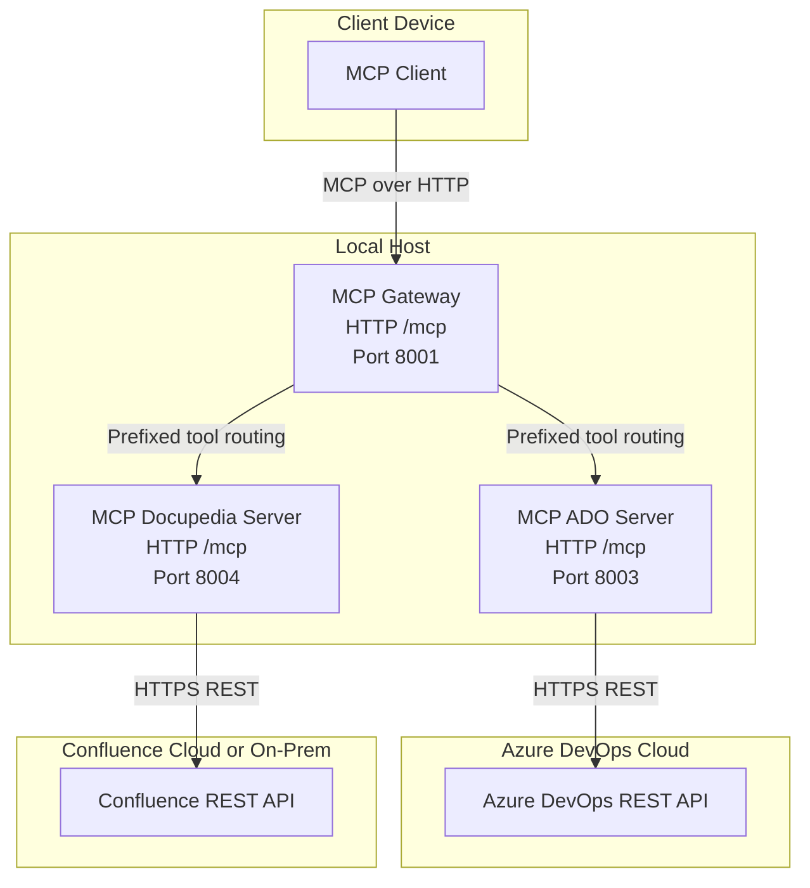

# MCP Connector – Deployment Diagram

Dieses Deployment-Diagramm zeigt die Laufzeitverteilung der Komponenten über Client, lokale Umgebung und externe Plattformen.

## Hinweise

- Gateway aggregiert beide MCP-Server und stellt einen zentralen MCP-Einstieg bereit.
- ADO- und Docupedia-Server sind als getrennte Deployments mit eigenen Ports dargestellt.
- Externe APIs sind als eigene Deployments außerhalb des lokalen Hosts modelliert.
