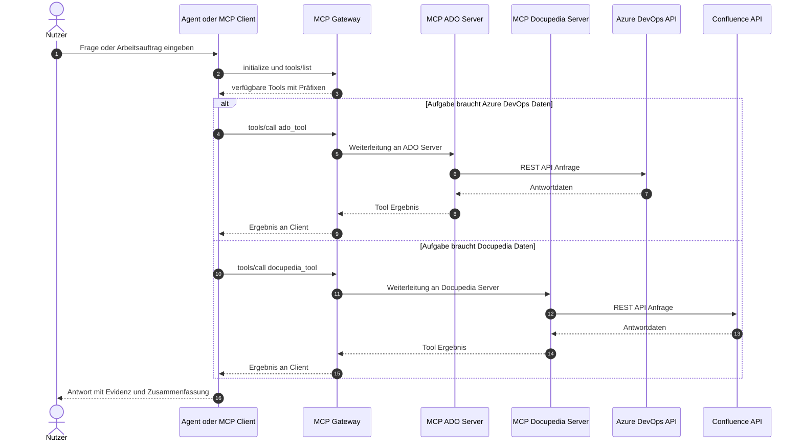

# MCP Connector – Interaktionsdiagramm

Dieses Diagramm zeigt, wie ein Nutzer mit dem Werkzeug interagiert und wie Requests über Gateway und MCP-Server verarbeitet werden.

## Hinweise

- Das Gateway ist der zentrale Einstiegspunkt für Tool-Calls.
- Die Auswahl des Zielservers erfolgt über den Tool-Präfix.
- Der Nutzer interagiert nur mit dem Client/Agent, nicht direkt mit den Backend-APIs.
